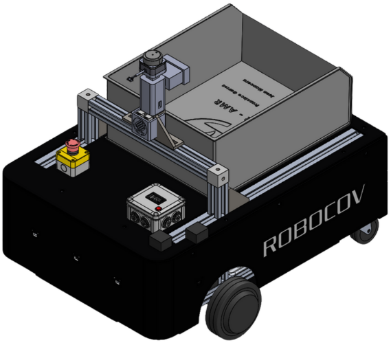
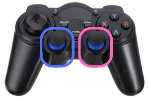
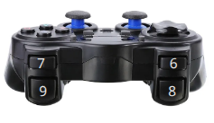

# Desarrollo de un Robot Móvil Autónomo para Entornos Logísticos en Interiores

<p align="center">
  
</p>

## 👤 Colaboradores

- [Jennifer Lizeth Avendaño Sánchez](https://github.com/jennyavsaa) (@jennyavsaa)
- [Juan Antonio Mancera Velasco](https://github.com/Juan-117) (@Juan-117)
- [Juan Francisco García Rodríguez](https://github.com/JFranciscoGR03) (@JFranciscoGR03)
- [Johan Donato Cabrera Martínez](https://github.com/JDonatoCM) (@JDonatoCM)

## 🤖 Descripción del sistema

El sistema fue desarrollado sobre la plataforma robótica **Robocov**, un robot móvil diferencial con estructura de aluminio tipo perfil Bosch. Su forma general corresponde a un prisma rectangular de aproximadamente $0.84\text{m} \times 0.61\text{m} \times 0.25\text{m}$, con caras de acrílico negro que protegen los módulos internos. El acceso a componentes se realiza retirando únicamente la cara superior, lo que facilita el mantenimiento.

La locomoción se basa en dos motores *brushless* tipo hub montados directamente sobre ruedas traseras, mientras que el eje delantero está estabilizado con ruedas locas. Esta configuración diferencial resulta adecuada para entornos planos y estructurados, como pasillos logísticos. Sin embargo, la distribución de masa dominada por la batería de 48V ubicada al centro del chasis introdujo desafíos en frenado y estabilidad durante maniobras a alta velocidad.

Para cumplir con los requerimientos del caso de uso, se incorporó una caja superior para transportar paquetes con masa variable. Esta estructura se fijó a la cara superior del robot, manteniendo la estabilidad del centro de gravedad. Adicionalmente, se diseñó e imprimió un soporte en 3D para montar de forma alineada el sensor LiDAR **RPLIDAR S3** y la cámara **Logitech Brio 100** sobre el eje longitudinal del robot, a una altura de $0.62\,\text{m}$ desde el suelo, evitando interferencias con la carga.

A nivel superficial, se integró una caja de control que aloja la **ESP32**, circuitos auxiliares y una pantalla digital que permite visualizar el voltaje en tiempo real. Esta funcionalidad resultó útil para monitorear el nivel de carga de la batería de 48V y verificar la correcta entrega de energía al controlador **VESC**. Además, el sistema incluye un botón físico de paro de emergencia montado en la parte posterior, el cual desconecta exclusivamente la alimentación de los motores, preservando el estado de la **Jetson** y los sensores.

<p align="center">
  
</p>

## ⚙️ Consideraciones de dirección y control

Inicialmente, se consideró que la parte delantera de Robocov sería como en un robot diferencial convencional, es decir, con las ruedas motrices al frente y las ruedas locas atrás. Por esta razón, el controlador **Flipsky VESC** fue configurado bajo esa suposición.

Sin embargo, durante el armado y pruebas del robot, se decidió invertir la orientación debido a la **distribución real del peso del chasis**, por lo que la parte delantera funcional de Robocov está compuesta por las ruedas locas, y el eje motriz quedó en la parte trasera.

Como consecuencia de que el **Flipsky VESC** permaneció con la configuración inicial, fue necesario ajustar la lógica de control de movimiento de la siguiente manera:

- En el código de **Micro-ROS**, la **velocidad lineal enviada a los VESCs está multiplicada por `-1`**, para invertir el sentido del avance/retroceso.
- Para invertir la **velocidad angular** correctamente, esta también está multiplicada por `-1`, pero directamente en los nodos de ROS 2 que publican en el tópico `/cmd_vel`.

Los nodos que aplican esta corrección son:

- `joystick_node`
- `lane_follower_node`
- `hybrid_navigation_node`
- `navigation_node`

Estos ajustes aseguran que el comportamiento del robot en navegación, seguimiento de carriles y control manual sea coherente con la dirección real del movimiento.

## 🧠 Estructura del proyecto (Carpeta `software/` y `extra/`)

El código fuente del sistema Robocov se encuentra en la carpeta `software/`, organizado en dos partes principales:

### 1. Micro-ROS

Contiene todo lo relacionado con el microcontrolador **ESP32**, encargado del control de los motores a través de **VESC** y la recepción de comandos de velocidad desde ROS 2.

- `software/Micro-ROS/ros2_utilities_ws/`: Workspace de ROS 2 diseñado para ejecutarse en la computadora o en la Jetson Orin Nano, utilizado para pruebas y depuración en paralelo con Micro-ROS.
  
- `software/Micro-ROS/libraries/`: Librerías de **Arduino** necesarias para el uso de **Micro-ROS** y para la comunicación con los **VESC** vía **UART**.

- `software/Micro-ROS/VESC_controller/`: Código principal que se carga en la ESP32. Se encarga de recibir comandos de velocidad (`cmd_vel`), calcular velocidades individuales para cada rueda, controlar los motores mediante VESC, y publicar la odometría hacia ROS 2.

### 2. ROS 2

Contiene el workspace de ROS 2 que se ejecuta en el sistema principal (Jetson Orin Nano o PC host). Está ubicado en `software/ROS2/` y sigue la estructura estándar de ROS 2 (`src/`, `build/`, `install/`, `log/`). Dentro de `src/` se encuentran los siguientes nodos:

#### Nodos activos principales:

- `navigation_node`: Nodo de navegación autónoma clásica basado en mapas, localización con AMCL y planeación de rutas. **Este nodo es suficiente para operar Robocov en todos los entornos.**

- `odometry_node`: Calcula y publica la odometría del robot a partir de las velocidades de las ruedas.

- `pause_node`: Nodo de seguridad que integra información del LiDAR y detección de personas mediante YOLO para detener al robot si hay personas en su trayectoria.

- `YOLO`: Nodo de detección de personas basado en visión. Utiliza el modelo **YOLOv8 nano**, optimizado para Jetson Orin Nano.

- `rplidar_ros`: Driver del sensor **RPLIDAR S3**, utilizado para escaneo láser en 2D, mapeo y localización.  
  > Este paquete fue **clonado directamente desde un repositorio de GitHub** previamente publicado.  
  > La única modificación realizada fue la **configuración del puerto serial** (`/dev/ttyUSBx`) para que coincidiera con el puerto asignado por el sistema al LiDAR.

#### Nodos experimentales o específicos:

- `lane_follower_node`: Nodo para seguimiento visual de líneas. **Solo fue utilizado durante pruebas**, ya que su funcionalidad está integrada dentro de `hybrid_navigation_node`.

- `hybrid_navigation_node`: Nodo que combina navegación tradicional con seguimiento visual de líneas. **Se utilizó exclusivamente en el almacén de Glaxo**, donde los pasillos marcados con líneas permitían a Robocov seguir trayectorias con alta precisión.

- `logic_node`: Nodo que alterna dinámicamente entre controladores (por ejemplo, entre navegación clásica y seguimiento de líneas). **Usado únicamente en Glaxo junto con `hybrid_navigation_node`.**

- `aruco_detection_node`: Nodo de detección de marcadores **Aruco**. Nunca se utilizó en la implementación final, pero se desarrolló como opción futura para posicionamiento por visión.

- `joystick_node`: Nodo para control manual con un joystick físico.

- `astar_planner`: Nodo que implementa planeación de rutas mediante el algoritmo A*.

Además, dentro de esta parte del proyecto se encuentra la carpeta:

- `urdf/`: Contiene el modelo del robot Robocov en formato URDF, utilizado para la visualización en RViz y para propósitos de simulación y transformaciones.

### 3. Archivo de lanzamiento (`launch.py`)

El sistema cuenta con un archivo de lanzamiento principal que permite ejecutar todos los nodos necesarios para la operación de Robocov. Actualmente, están **comentados** los siguientes nodos:

- `logic_node`
- `hybrid_navigation_node`
- `lane_follower_node`
- `aruco_detection_node`

Esto se debe a que esos nodos solo eran relevantes en contextos específicos como el almacén de Glaxo. En su estado actual, el archivo de lanzamiento está optimizado para funcionar **en cualquier entorno**, utilizando únicamente los nodos esenciales.

> **Así como está el `launch.py` actualmente, Robocov funciona perfectamente en cualquier ambiente, sin necesidad de seguimiento visual de líneas.**
> Nota: Las carpetas `build/`, `install/` y `log/` son generadas automáticamente por ROS 2 (`colcon build`).


### 4. Archivos adicionales (`extra/`)

La carpeta `extra/` contiene archivos auxiliares necesarios para la operación completa del sistema:

- `mapas/`: Carpeta que incluye los mapas utilizados por el robot, tanto para localización como para planeación de rutas:
  - Archivos `.pgm` y `.yaml` correspondientes a **Glaxo** y **Aulas I**.
  - Los archivos de mapa **crudos** son utilizados por el sistema de localización (`AMCL`).
  - Los mapas con sufijo **`_edited`** han sido modificados para mejorar la planificación de rutas y son compatibles con el nodo `astar_planner`.

- Archivos `.yaml` principales:
  - `mapa.yaml`: Archivo para inicializar el mapa al lanzar el sistema.
  - `amcl_params.yaml`: Parámetros personalizados para el nodo de localización `AMCL`.
  - `camera_calibration.yaml`: Archivo con la calibración intrínseca de la cámara, útil si se requiere detección basada en visión (por ejemplo, YOLO o ArUco). Dentro de la Jetson, este archivo se encuentra en la ruta `.ros/camera_info`.

## 🔒 Consideraciones importantes

Antes de ejecutar el sistema Robocov, es importante considerar los siguientes aspectos para asegurar una experiencia fluida:

1. **IMU (BNO055) desactivada por defecto**  
   Al inicio del desarrollo se utilizaba un IMU BNO055 para mejorar la localización del robot. Por ello:
   - El archivo `ekf.yaml`, ubicado en la carpeta `config/` del workspace de ROS 2, contiene la configuración del filtro EKF con soporte para IMU, actualmente comentado.
   - El sensor IMU también aparece definido en el modelo URDF y en las transformaciones estáticas.
   Actualmente, el robot se localiza perfectamente usando únicamente AMCL con el LiDAR, por lo que el uso de la IMU es **opcional y no requerido** para el funcionamiento base.

2. **Puertos seriales personalizados**  
   Para evitar cambios aleatorios en los puertos USB al conectar dispositivos, se crearon **aliases persistentes** para los dispositivos seriales:
   - `/dev/ttyUSB0_custom`: corresponde a la **ESP32**.
   - `/dev/ttyUSB1_custom`: corresponde al **LiDAR**.
   - `/dev/ttyUSB2_custom`: correspondía al **IMU**. Actualmente no se utiliza.

   Esto garantiza que, sin importar el orden de conexión o reinicios, los dispositivos mantendrán sus rutas consistentes.

3. **Red local con módem en modo puente**  
   Robocov utiliza una red local generada por un **módem configurado en modo puente**, el cual recibe Internet a través de un **teléfono celular en modo hotspot**.  
   A esta red se conectan tanto:
   - La **Jetson Orin Nano**, instalada en el robot.
   - La **computadora remota**, que se conectará por **SSH** para control, monitoreo o desarrollo.

   Esta configuración permite operar en entornos sin infraestructura de red disponible, como almacenes o aulas.

4. **Inicio automatizado con Telegram y acceso SSH**  
   El sistema Jetson está configurado con **`systemd`** para ejecutar un script al arrancar que envía un mensaje por **Telegram** con la dirección IP local del dispositivo. Esto permite saber la IP sin necesidad de conectar una pantalla o teclado.

   Con esa IP, se puede acceder remotamente mediante SSH:
   ```bash
   ssh jumpers@<direccion_ip>
   ```

   Esto permite tanto modificar código como ejecutar el sistema remotamente. La edición de código puede realizarse de dos formas:
   - Con el editor de texto nano directamente en terminal.
   - Usando Visual Studio Code con la extensión Remote - SSH, lo que permite trabajar con la Jetson desde tu computadora como si fuera local.

## 🚀 Uso del sistema

Para operar correctamente a Robocov se recomienda utilizar **tres terminales**:

1. **Terminal 1 (SSH a la Jetson)**  
   Ejecuta el sistema principal de ROS 2:
   ```bash
   ros2 launch amr_reto_ws robocov_bringup_launch.py
   ```

2. **Terminal 2 (SSH a la Jetson)**  
   Lanza el agente de Micro-ROS que se comunica con la ESP32:
   ```bash
   ros2 run micro_ros_agent micro_ros_agent serial --dev /dev/ttyUSB0_custom
   ```

3. **Terminal 3 (En la computadora personal)**  
   Ejecuta RViz para visualizar el estado del robot:
   Lanza el agente de Micro-ROS que se comunica con la ESP32:
   ```bash
   rviz2
   ```

> Se pueden abrir más terminales para propósitos de depuración o monitoreo adicional (por ejemplo, ros2 topic echo, rqt, etc.).

### Inicialización del sistema

Una vez que la ESP32 esté conectada correctamente y Micro-ROS esté activo, se debe preparar **RViz** para visualizar correctamente el entorno y el estado del robot antes de asignar la posición inicial.

Para ello:

1. En la parte **inferior izquierda de RViz**, haz clic en el botón **“Add”**.
2. Añade los siguientes elementos:

   - **TF** → Para visualizar las transformadas entre los distintos frames del robot.
   - **RobotModel** → Para ver el cuerpo del robot.  
     Luego, en la opción **“Topic”**, selecciona:  
     ```
     /robot_description
     ```
   - **Map** → Para visualizar el mapa del entorno.  
     Luego, en la opción **“Topic”**, selecciona:  
     ```
     /map
     ```  
     Y en **“Durability Policy”**, cambia a:  
     ```
     Transient Local
     ```
   - **LaserScan** → Para visualizar el escaneo del LiDAR.  
     Selecciona el tópico:  
     ```
     /scan
     ```
   - **PoseWithCovarianceStamped** → Para mostrar la **elipse de covarianza** generada por AMCL en la posición actual del robot.
   - **Path** → Para visualizar la **ruta planeada** por el planeador A\*.  
     En la opción **“Topic”**, selecciona:  
     ```
     /waypoints
     ```

Una vez agregados todos estos elementos, ya es posible asignar una **posición inicial** al robot usando la herramienta **“2D Pose Estimate”** en RViz.

Esto es esencial para que el nodo **AMCL** tenga una estimación inicial de la ubicación del robot en el mapa y pueda realizar una localización efectiva.

> Este paso es obligatorio **cada vez que se lanza el sistema completo**, de lo contrario el robot no podrá localizarse correctamente y la navegación autónoma no funcionará.

### Modos de operación

Al arrancar, Robocov inicia en **modo de control manual**, es decir, el control por **gamepad** está activo por defecto.

- **Joystick izquierdo**: controla la **velocidad lineal** (adelante / atrás).
- **Joystick derecho**: controla la **velocidad angular** (izquierda / derecha).

<p align="center">
  
</p>

En este modo, los nodos `navigation_node` y `astar_planner` están **inactivos**. El robot no planeará ni seguirá rutas automáticamente.

### Activar navegación autónoma

<p align="center">
  
</p>

Para cambiar al modo autónomo:

- Deben presionarse **cuatro botones específicos del control** (combinación definida en el código).
- Una vez activado el modo autónomo:
  - En **RViz**, utiliza la herramienta **"Publish Point"** para hacer clic en el mapa e indicar el punto objetivo.
  - El sistema generará un **path** y el robot comenzará a navegar hacia esa ubicación de forma autónoma.

### Paros de emergencia

Robocov incluye varias formas de detenerse de inmediato ante cualquier situación peligrosa o comportamiento inesperado:

#### Paro por software
- Si el robot presenta movimientos no deseados durante la navegación autónoma, se puede presionar nuevamente la combinación de **4 botones del gamepad**.
- Esto **regresa el control al modo manual**, que siempre tiene prioridad sobre el sistema autónomo.

#### Paro físico por botón
- El robot tiene un **botón físico de paro de emergencia**.
- Al presionarlo, se **corta el voltaje de las llantas**, deteniendo el movimiento del robot de forma inmediata.

#### Paro por radiofrecuencia
- En caso de estar lejos del robot, se puede usar el **control por radiofrecuencia**.
- Presionando el **botón derecho del control**, se corta el suministro eléctrico desde la batería principal.

Estas tres opciones garantizan redundancia y seguridad operativa, tanto en entornos de prueba como de implementación real.

## 🛠 Posibles fallas y soluciones

A continuación se listan algunos problemas que pueden presentarse durante la operación del sistema, junto con sus causas y soluciones recomendadas:

### Conectividad e Internet móvil

- Si el **internet del celular** que provee la red es lento o inestable, puede afectar el comportamiento general del robot (por ejemplo, retrasos en comandos o desconexiones).
- El **celular debe estar siempre cerca del módem** para asegurar buena señal.
- El **módem está instalado directamente en el robot** para que siempre esté cerca de la Jetson.
- La **computadora que se conecta por SSH** también debe estar relativamente cerca del módem para evitar interferencias o pérdida de conexión.

### Fallos en Micro-ROS

- En raras ocasiones, **Micro-ROS puede dejar de responder** o no establecer conexión después de un reinicio del sistema. En estos casos es recomendable hacer un **paro de emergencia** (físico o por radiofrecuencia), y reiniciar Micro-ROS.
- También puede suceder que al ejecutar el comando:
  ```bash
  ros2 run micro_ros_agent micro_ros_agent serial --dev /dev/ttyUSB0_custom
  ```
  aparezca un error de conexión serial en letras rojas. Esto se soluciona fácilmente desconectando y reconectando el cable micro-USB de la ESP32.

### Desconexión del gamepad

- Debido a la **baja calidad del control inalámbrico** o a un **nivel bajo de batería**, el **gamepad puede desconectarse de forma intermitente**.
- Cuando esto sucede, los **LEDs del control comienzan a parpadear rápidamente**.
- En condiciones normales, cuando el gamepad está **conectado correctamente a la Jetson**, **solo un LED permanece encendido** de forma constante.
- Se recomienda verificar el estado del control al iniciar el sistema y tener **baterías de repuesto** disponibles.

### Estimación incorrecta de la posición inicial

- Si el robot se encuentra **muy alejado de su posición real en el mapa** y se le asigna una `initial_pose` incorrecta mediante la herramienta **"2D Pose Estimate"** en RViz, el **robot puede perder la referencia**, moverse de forma errática o tardar mucho en localizarse.
- En estos casos, se recomienda repetir el proceso de estimación de pose **2 o 3 veces**, ajustando tanto la **posición** como la **orientación** hasta que el nodo **AMCL** logre una localización confiable y estable.

## 🔧 Posibles mejoras al sistema

A continuación se listan algunas propuestas para futuras versiones de Robocov, con el objetivo de mejorar su rendimiento, integración y maniobrabilidad en entornos logísticos reales:

- **Integrar métricas dinámicas en el planeador A\*** o utilizar A\* híbrido para una navegación más inteligente y orientada a tareas reales.

- **Conectar con el sistema de administración del almacén** y bases de datos en tiempo real, permitiendo que el robot reciba órdenes logísticas dinámicas y reporte su estado automáticamente.

- **Implementar una red local independiente y robusta** para eliminar la dependencia del celular y mejorar la estabilidad en campo.

- **Optimización del nodo `pause_node`** para tomar decisiones más inteligentes en la detección de personas o obstáculos mediante fusión de visión y LiDAR.

- **Mejoras en el manejo de fallas en Micro-ROS**, con reconexión automática al agente sin necesidad de reinicio físico.

- **Cambio del control inalámbrico** por uno de mayor calidad y estabilidad, con mejor conexión Bluetooth o 2.4 GHz.

## 🎥 Funcionamiento del robot

[Video de demostración de Robocov en Glaxo (prueba previa).](https://youtu.be/yPrvOlhJz0o)  
[Video de demostración de Robocov en Aulas I (prueba final).](https://youtu.be/GQvPp4Hcdwo)

## 📘 Notas finales

Esta guía proporciona una **visión general del funcionamiento de Robocov**, incluyendo su estructura, uso y consideraciones técnicas esenciales.

Para una explicación más detallada del desarrollo, diseño de software y decisiones técnicas, se recomienda revisar los documentos disponibles en la carpeta `docs/`. Allí encontrarás una **presentación** y un **reporte técnico** que profundizan en la implementación del sistema.

### Aplicabilidad a otros robots

Aunque esta guía está basada en el robot Robocov, **la mayoría del sistema es aplicable a cualquier robot diferencial**, incluyendo:

- Nodo de navegación
- Control mediante joystick
- Planeador A* y manejo de mapas
- Micro-ROS y comunicación con motores mediante UART

Solo es necesario **modificar los parámetros específicos del robot**, como el URDF, configuración del EKF, dimensiones, y controladores físicos para adaptar esta implementación a otros modelos.

> Esta arquitectura modular permite escalar fácilmente a distintas plataformas móviles y entornos reales.
